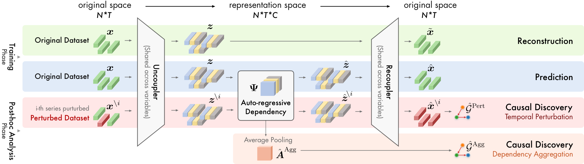

# 🧬 UnCLe: Towards Scalable Dynamic Causal Discovery in Non-linear Temporal Systems

This repository contains the official implementation and datasets for the **🏆 NeurIPS 2025** paper **"UnCLe: Towards Scalable Dynamic Causal Discovery in Non-linear Temporal Systems"**.

## 🏗️ Model Architecture


<center>UnCLe uses a pair of neural networks we call an <i>Uncoupler and Recoupler</i> to disentangle the complex signals and learnable <i>auto-regressive dependency</i> matrices to capture the interplay between different series.</center>

## 💡 Motivation

Uncovering cause-effect relationships from observational time series is fundamental to understanding complex systems. While many methods infer static causal graphs, real-world systems often exhibit **dynamic causality**—where relationships evolve over time (e.g., seasonal shifts in predator-prey dynamics, developmental changes in gene networks, or phase-dependent biomechanics).

Accurately capturing these temporal dynamics requires **time-resolved causal graphs**. However, existing paradigms often focus on static graphs or fail to explicitly model how causal laws adapt. **UnCLe** (UnCoupLing causality) addresses this gap by introducing a scalable deep learning framework designed to discover and represent these evolving structures in non-linear systems.

## ✨ Contributions

- **🔮 UnCLe Framework**: A novel deep learning method capable of generating time-resolved causal graphs. It employs a pair of **Uncoupler** and **Recoupler** networks to disentangle input time series into semantic representations.
- **📈 Dynamic Dependency Modeling**: Learns inter-variable dependencies via auto-regressive **Dependency Matrices** within the latent semantic channels.
- **🔍 Perturbation-based Inference**: Estimates dynamic causal influences by analyzing datapoint-wise prediction errors induced by targeted temporal perturbations, allowing for precise identification of when and how causal links change.
- **🚀 Scalability & Performance**: Demonstrated superior ability to capture evolving causality on synthetic benchmarks (time-varying SEMs) and real-world systems (e.g., Human Motion Capture), while maintaining state-of-the-art performance on static baselines.

## 📂 Project Structure

### `bin/` Directory
This directory contains the core source code and execution scripts for the experiments.

*   🐍 **`experimental_utils.py`**: Contains the core implementation of the **UnCLe model** (implemented as `VARP` class) and the main training/evaluation logic (`run_unicsl`).
*   ⚙️ **`run_grid_search.py`**: The main driver script for running experiments, handling hyperparameter grid searches, and logging results.
*   📜 **`run_*`** (e.g., `run_l96_0`, `run_finance`, `run_fmri`): Bash scripts to launch specific experiments with predefined configurations.

### `datasets/` Directory
Located at the project root `../datasets/`, this folder contains the data used for evaluation.

#### 🧪 Synthetic Datasets
*   **Lorenz96 (`Lorenz96/`)**: A classic dynamical system benchmark.
*   **NC8 / ND8 (`NC8/`, `ND8/`)**: Non-linear causal benchmarks with 8 nodes (Neural Causal / Neural Dynamic).
*   **TVSEM (`TVSEM/`)**: Time-Varying Structural Equation Models data to test dynamic causal discovery capabilities.

#### 🌍 Real-World Datasets
*   **Finance (`Finance/`)**: Stock market data to analyze economic causal dependencies.
*   **fMRI (`fMRI/`)**: Blood-oxygen-level-dependent (BOLD) signals to study brain connectivity dynamics.
*   **MoCap (`MoCap/`)**: Human Motion Capture data (e.g., `jump.avi`, `motion_16_09.csv`) used to demonstrate UnCLe's ability to interpret biomechanical phases.

## 🛠️ Usage

### 1. Installation 📦
We recommend using **Python 3.8.10**. Install the required dependencies using pip:

```bash
pip install -r requirements.txt
```

### 2. Running Experiments 🏃
You can reproduce the experiments by running the provided shell scripts in the `bin/` directory.

**Example: Running on Lorenz 96 dataset**
```bash
bash ./run_l96_0
```

The script typically calls `run_grid_search.py` with specific arguments (dataset, model parameters, training epochs). 

### 3. Results 📊
The experiment logs and results (including inferred causal structures and accuracy metrics) will be saved in the `logs/` directory generated during execution.
